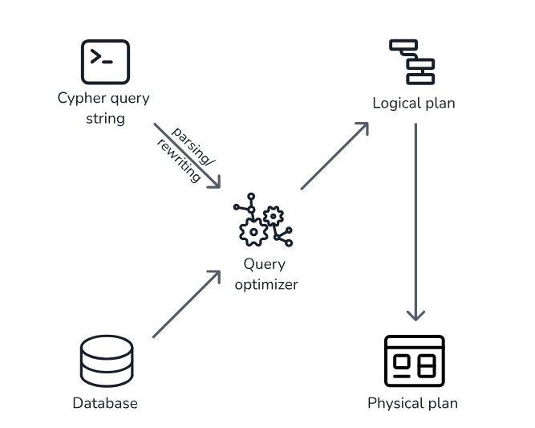
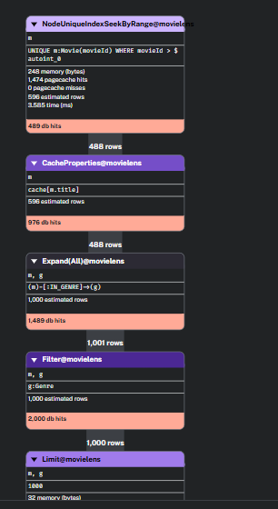
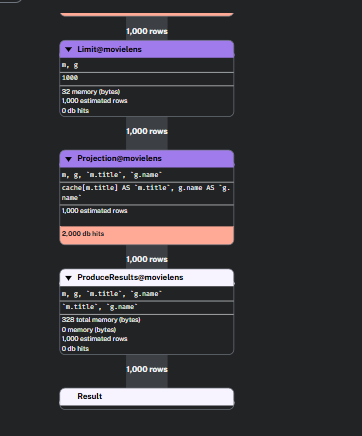

x`Neo4j’s graph database model is built around **three core entities**:

- **Nodes** — entities or objects (like `Movie`, `Person`, `City`)
    
- **Relationships** — directed edges connecting nodes (e.g., `(:Person)-[:ACTED_IN]->(:Movie)`)
    
- **Paths** — traversals or sequences of nodes connected via relationships
    

---

## ⚙️ EXPLAIN

`EXPLAIN` **shows the execution plan** for a query, but **does not execute** it.

- It produces the **physical execution plan** that Neo4j would use if the query were run.
    
- Useful for seeing **how Neo4j plans to access data** (label scans, index seeks, joins, etc.).
    
- Includes **estimated** rows and costs based on internal statistics.
    

Use `EXPLAIN` early in query tuning to predict performance before affecting the database.

---

## ⚙️ PROFILE

`PROFILE` **runs your query** and records runtime statistics for each operator:

- Shows how many **rows** passed through each operator.
    
- Shows how many **DB hits** (storage accesses) occurred.
    
- Same plan as `EXPLAIN`, but now includes **actual runtime metrics**.
    

Use `PROFILE` after using `EXPLAIN` to **validate estimates vs. reality** — large differences between estimated and actual rows may suggest missing indexes or suboptimal patterns.

---

## 🔄 Lifecycle of a Cypher Query

After parsing, the Cypher query string goes through the **query optimizer**, which produces an **imperative plan** — known as the **logical plan** — that determines the most efficient way to execute the query given the **current state of the database** (schema, indexes, and statistics).

In the final phase, this logical plan is turned into an **executable physical plan**, which is what you see in `EXPLAIN` or `PROFILE`.

---

## ⚙️ Operators

 An operator is, in turn, a specialized execution module that is responsible for some type of transformation to the data before passing it on to the next operator, until the desired graph pattern has been matched.

---

### Common Operators

| Operator                  | Description                                                      |
| ------------------------- | ---------------------------------------------------------------- |
| **AllNodesScan**          | Reads all nodes from the node store.                             |
| **Filter**                | Filters rows based on a predicate (`WHERE` clause).              |
| **NodeByLabelScan**       | Fetches all nodes with a specific label from the label index.    |
| **NodeIndexSeek**         | Uses an index to find nodes by property value.                   |
| **Expand(All)**           | Traverses relationships from matched nodes.                      |
| **Projection**            | Returns specific values (e.g., `RETURN n.name`).                 |
| **HashJoin / NestedLoop** | Combines data from multiple matches.                             |
| **Aggregation**           | Computes functions like `COUNT`, `AVG`, etc.                     |
| **Eager**                 | Forces materialization of intermediate results (memory barrier). |

_Table of all operators_: https://neo4j.com/docs/cypher-manual/current/planning-and-tuning/operators/

---

The **execution plan** is essentially a **tree (or DAG) of operators**, where each node performs a small piece of the query.  
Understanding which operators are used — and in what order — is key to performance tuning.

---

## 🧩 Execution Plan

The **execution plan** is a structured tree of operators that defines _how_ the query will run.

**Query**

`PROFILE MATCH (m:Movie)-[:IN_GENRE]->(g:Genre) 
`WHERE m.movieId > 100 
`RETURN m.title, g.name 
`LIMIT 1000;`

**Query Process**

- **Parsing & Semantic Analysis**
	Neo4j parses this into an **AST** (Abstract Syntax Tree), then performs semantic analysis to resolve:
	- Variables: `m`, `g`
	    
	- Labels: `Movie`, `Genre`
	    
	- Relationship type: `IN_GENRE`
	    
	- Properties: `m.movieId`, `m.title`, `g.name`
	    
	- Filter: `m.movieId > 100`
	    
	
	At this point Neo4j knows:
	
	- You’re starting from `:Movie` nodes.
	    
	- Filtering by a numeric property.
	    
	- Traversing `IN_GENRE` to `:Genre`.
	
- **Logical plan**

	A logical plan is produced for each query graph (depending on the query, a query graph may consist of sub query graphs). This is done in a step-by-step fashion following a bottom-up approach. 
	
	At each step, we firstly obtain data such as index and label selectivity from our new statistics store. This data is then used to estimate the cardinality – this is the number of matching rows – using information from the query graph. With this we can estimate a cost, which is used to build a candidate logical plan. (khúc này ý nó là nó chia cái query graph chính thành nhiều query graphs nhỏ để tính toán cost để build thành 1 logical plan)
	
	Thus at each step, multiple candidate logical plans for the query graph are produced. (Tại các step thì nó có thể phân ra nhiều hướng từ đó tạo ra nhiều paths khác nhau nên hình thành nhiều plans. Ví dụ như giữa việc sử dụng index `NodeIndexSeek` và scan tất cả các nodes `NodeByLabelScan`)
	
	### Plan 1 (Start from Movie via Index)
	`ProduceResults  
		`└─ Projection(m.title, g.name)      
			`└─ Limit(1000)          
				`└─ Expand(m)-[:IN_GENRE]->(g)              
					`└─ NodeIndexSeek(m:Movie(movieId > 100))`

	### Plan 2 (Start from Movie via LabelScan)
	`ProduceResults  
		`└─ Projection(m.title, g.name)      
			`└─ Limit(1000)          
				`└─ Expand(m)-[:IN_GENRE]->(g)              
					`└─ Filter(m.movieId > 100)                  
						`└─ NodeByLabelScan(m:Movie)`
	...
	
	A greedy search strategy is used to pick the cheapest logical plan from the multiple candidates as the process percolates up the query graph.
	

- **Execution plan**

	An execution plan is created from the logical plan by choosing a physical implementation for logical operators, and subsequently cached
	
	
	
	`┌────────────────────────────────────────────┐
	`│ NodeUniqueIndexSeekByRange@movielens       │
	`│ UNIQUE m:Movie(movieId) WHERE movieId > 100│
	`└────────────────────────────────────────────┘
	                 ▼
	`┌────────────────────────────────────────────┐
	`│ CacheProperties@movielens                  │
	`│  cache[m.title]                            │
	`└────────────────────────────────────────────┘
	                 ▼
	`┌────────────────────────────────────────────┐
	`│ Expand(All)@movielens                      │
	`│  (m)-[:IN_GENRE]->(g)                      │
	`└────────────────────────────────────────────┘
	                 ▼
	`┌────────────────────────────────────────────┐
	`│ Filter@movielens                           │
	`│  g:Genre                                   │
	`└────────────────────────────────────────────┘
	                 ▼
	`┌────────────────────────────────────────────┐
	`│ Limit@movielens                            │
	`│ limit: 1000                                │
	`└────────────────────────────────────────────┘
	                 ▼
	`┌────────────────────────────────────────────┐
	`│ Projection@movielens                       │
	`│ cache[m.title] AS m.title, g.name AS g.name│
	`└────────────────────────────────────────────┘
	                 ▼
	`┌────────────────────────────────────────────┐
	`│ ProduceResults@movielens                   │
	`│  Columns: m.title, g.name                  │
	`└────────────────────────────────────────────┘
	
	**Explain**
	- `Rows`: The number of records (rows) produced by this operator and passed to the next one
	- `db hits`: Each operator will send a request to the storage engine to do work such as retrieving or updating data. A _database hit_ is an abstract unit of this storage engine work.
	- `total memory`: The **memory allocated** by operator.
	- `Estimated Rows`: The **query planner’s prediction** of how many rows the operator would produce, based on statistics and indexes.
	
	`Operator`
	- `NodeUniqueIndexSeekByRange@movielens`: Uses the unique index on `Movie(movieId)` to seek nodes where `movieId > 100`
	- `CacheProperties@movielens`: Caches the property `m.title` for reuse later (Reduce redundant `db hits`).
	- `Expand(All)@movielens`: Traverses relationships `(m)-[:IN_GENRE]->(g)`
	- `Filter@movielens`: Ensures `g` nodes have the label `:Genre`.
	- `Limit@movielens`: Stops processing after 1,000 rows.
	- `Projection@movielens`: Selects only `m.title` and `g.name`.
	- `ProduceResults`: Outputs the final rows to the user.

---
## 🧩 Resources

Cypher Query Optimizer: https://neo4j.com/blog/cypher-and-gql/introducing-new-cypher-query-optimizer/

Execution plans: https://neo4j.com/docs/cypher-manual/current/planning-and-tuning/execution-plans/

Table of all operator: https://neo4j.com/docs/cypher-manual/current/planning-and-tuning/operators/

# Following work 
- Nghiên cứu cơ chế tương tự như Relational Algebra, xem khi cypher parse sẽ ra cấu trúc gì. Xử lý như thế nào
	- Vd như SQL thì khi parse sẽ ra relational algebra, sau đó tiến hành tối ưu từ cái cây. Thì xem cypher sẽ là như thế nào??? =))) 
- Nghiên cứu cách cypher optimize query.