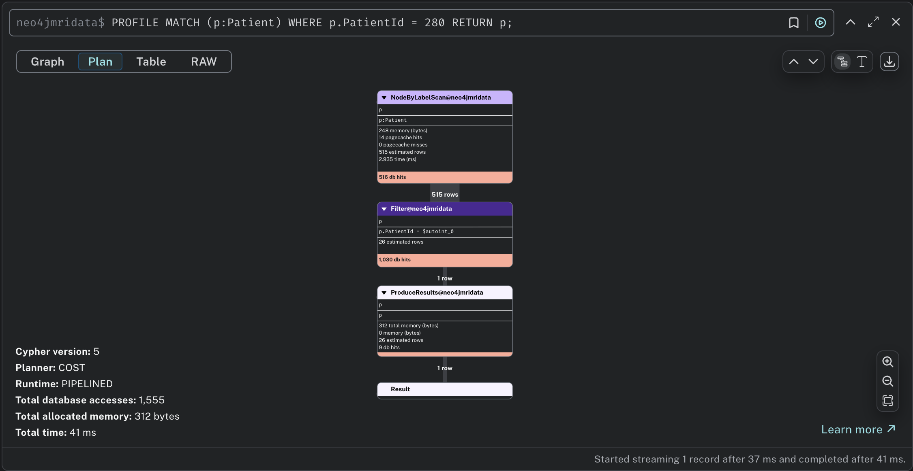
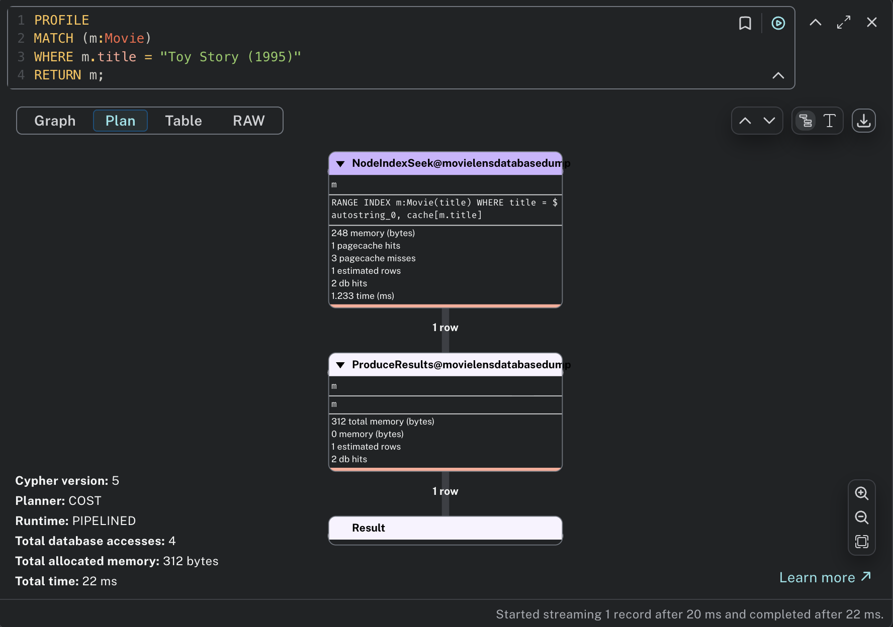

# Neo4j Indexing Mechanisms

This document explains how Neo4j indexing works, focusing on **schema indexes**, and **full-text indexes**, with practical examples.

---

## 1. Overview

Neo4j provides several types of indexes to improve query performance:

- **Schema Index** → Standard index for exact property lookups.
- **Full-text Index** → Used for keyword or text-based search.
- **Lookup Index** → Automatically created by Neo4j to speed up lookups by label or relationship type.

---

## 2. Schema Index

Schema indexes are the most common type of index in Neo4j.  
They allow fast lookups when filtering nodes or relationships by exact property values [1].

### Example

```cypher
MATCH (m:Movie)
WHERE m.title = "Toy Story (1995)"
RETURN m;
```
Without an Index

- Neo4j performs a Node Label Scan, scanning all nodes with label Movie.

- For example, if there are 100,000 Movie nodes:

    - The database must check each node’s title property.

    - This is time-consuming and results in high DB hits.




With a Schema Index

Create an index on the `title` property:
```Cypher
CREATE INDEX movie_title_index FOR (m:Movie) ON (m.title);
```
Neo4j will:

1. Scan all existing Movie nodes.

2. Store a mapping between each node ID and its title value in a B-tree index.

3. Save this index separately, allowing future queries to find nodes efficiently.

When the same query runs again:

- Neo4j detects that an index exists for Movie(title).

- It uses a Node Index Seek instead of a full label scan.



### When Neo4j Can Use a Schema Index

Neo4j will only use a schema index when:

- The `WHERE` clause filters directly on an indexed property.

- The property is not wrapped in a function (e.g., toLower(m.title) cannot use the index).

- There are no complex OR conditions involving non-indexed properties.

## 3. Full-text Index 
Full-text indexes are used for keyword-based text search.
They rely on the Lucene analyzer to tokenize and normalize text [2].

### Creating a Full-text Index
```Cypher
CALL db.index.fulltext.createNodeIndex(
  "movieTitleIndex", ["Movie"], ["title"]
);
```

Neo4j will:

1. Scan all `:Movie` nodes.

2. Extract the `title` property.

3. Process each title through the Lucene analyzer, which:

    - Converts text to lowercase.

    - Tokenizes words.

    - Removes punctuation and stop words (`the`, `a`, `of`, etc.).

    - Builds an inverted index mapping words to node IDs.

Example of Inverted index: 

|Term          |Node IDs|
|--------------|--------|
|avatar        |[1]     |
|avengers      |[2]     |
|science fiction| [1, 3] |

### Querying a Full-text Index

Instead of using `MATCH ... WHERE`, use the `db.index.fulltext.queryNodes` procedure:
```Cypher
CALL db.index.fulltext.queryNodes(
  "movieTitleIndex", "avatar"
) YIELD node, score
RETURN node, score
ORDER BY score DESC;
```
Lucene calculates a relevance score based on text similarity:

- Nodes with exact matches appear first.

- Similar terms (e.g., "avatars", "the avatar returns") may also match, depending on the analyzer.

## 4. Comparison Table 
|Index Type|Purpose|Example|
|----------|-------|-------|
|Schema Index|Speeds up lookups by property value|`CREATE INDEX movie_title_index FOR (m:Movie) ON (m.title);`|
|Full-text Index|Enables keyword search on text properties|`CALL db.index.fulltext.createNodeIndex("movieTitleIndex", ["Movie"], ["title"]);`|


## 5. Key notes
- Neo4j automatically uses indexes when you run `MATCH` with a `WHERE` filter on an indexed property.

- Use schema indexes for exact equality lookups.

- Use full-text indexes for keyword or fuzzy text searches.

- Use `EXPLAIN` or `PROFILE` to verify if an index is being used in your query plan.


## Reference

[1] **Neo4j Documentation: Indexes for Search Performance**  
<https://neo4j.com/docs/cypher-manual/current/indexes-for-search-performance/>

[2] **Apache Lucene** – Open-source text search engine library used internally by Neo4j.  
<https://lucene.apache.org/>